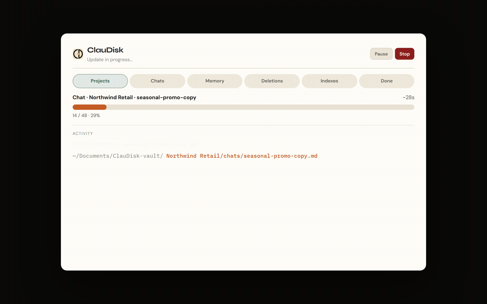
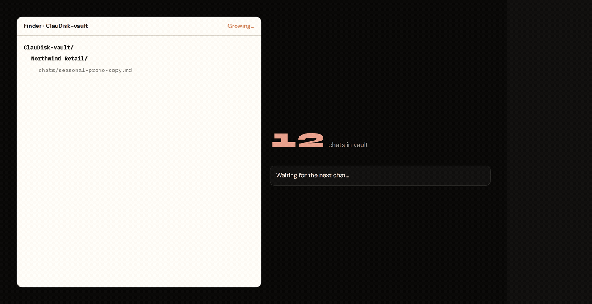

# ClauDisk

<p align="center">
  
</p>

<p align="center">
  <strong>Living local mirror of Claude.ai projects</strong><br />
  Chats, docs, files, memory &amp; artifacts as Markdown for Cursor / Claude Code.<br />
  <em>Unofficial · local-first · MIT · free</em>
</p>

<p align="center">
  <a href="./LICENSE"></a>
  <a href="./manifest.json"></a>
  <a href="./CHANGELOG.md"></a>
  <a href="https://claudisk-web.vercel.app"></a>
</p>

> Not affiliated with Anthropic. Unofficial community tool. Use at your own risk and respect Claude’s Terms of Service.

Claude keeps knowledge **inside project walls**. You brainstorm architecture in one project, draft a product brief in another, paste specs into a third - and when you open Cursor or Claude Code, none of that history is on disk. Cross-project questions (“what did we decide about auth?”) mean hunting tabs, copy-pasting, or starting over.

**ClauDisk** was built for that gap: a Chrome / Edge extension that mirrors your Claude.ai projects into a **folder you choose**. Chats, project docs, memory, artifacts, and attachments become plain Markdown and files. Every new chat keeps joining the vault. Point your AI tools at that folder and ask across projects in one go - with paths you can cite, search, and version.

**Where it helps in practice**

- You live in Cursor or Claude Code and want Claude.ai project history as **local context**, not screenshots or manual exports
- You juggle several Claude projects (client work, side projects, research) and need one searchable brain on disk
- You want a **backup you own**: soft-delete, verify, statistics - without sending vault data to a ClauDisk server
- You prefer incremental sync while you browse claude.ai, not a brittle one-shot dump that goes stale tomorrow

<p align="center">
  
</p>
<p align="center"><em>Update in progress: projects, chats, memory, indexes - live on disk.</em></p>

<p align="center">
  
</p>
<p align="center"><em>New chats keep landing in the vault - always ready for your AI tools.</em></p>

**What’s new:** [CHANGELOG](./CHANGELOG.md) · in-extension Settings → What’s new

## Contents

| | |
| :--- | :--- |
| [Quick start](#quick-start) | Four steps from install to first vault |
| [Why ClauDisk](#why-claudisk) | One-shot export vs a living local mirror |
| [How it works](#how-it-works) | Button → plan → disk → Cursor / Claude Code |
| [Install (Chrome or Edge)](#install-chrome-or-edge) | Unpacked load on Chromium browsers |
| [Features](#features) | Dry-run, tags, soft-delete, stats, and more |
| [Privacy](#privacy) | Local-first; nothing leaves your machine via ClauDisk |
| [Project layout](#project-layout) | Where the extension code lives |
| [Contributing](#contributing) | How to help |
| [Roadmap](#roadmap) | Store listings and site polish |
| [Disclaimer](#disclaimer) | Unofficial tool; respect Anthropic’s ToS |
| [License](#license) | MIT |

---

## Quick start

1. Load the unpacked extension in Chrome or Edge (`chrome://extensions` / `edge://extensions`)
2. Open [claude.ai](https://claude.ai) and click the ClauDisk button
3. Choose a local folder → run **Update**
4. Open that folder in Cursor or Claude Code and ask across projects

Details: [Install](#install-chrome-or-edge) · release notes: [CHANGELOG](./CHANGELOG.md)

---

## Why ClauDisk

Most tools do a **one-shot export**. ClauDisk keeps a **living folder** on your machine.

| | |
| --- | --- |
| **Projects as folders** | `chats/`, `knowledge/`, `artifacts/` |
| **Incremental sync** | While you browse claude.ai |
| **Full local copy** | Memory, instructions, binaries, attachments |
| **Agent-ready** | Markdown + indexes for Cursor / Claude Code |
| **Private by design** | No ClauDisk servers, no telemetry |

---

## How it works

### 1. One button on Claude.ai

<p align="center">
  
</p>
<p align="center"><em>Bottom-right on claude.ai - open the mirror when chats change.</em></p>

### 2. Control room

<p align="center">
  
</p>
<p align="center"><em>Folder connected, permission granted, ready to Update.</em></p>

### 3. Dry-run before write

<p align="center">
  
</p>
<p align="center"><em>See the plan first - confirm only when you want files written.</em></p>

### 4. Archive statistics

<p align="center">
  
</p>
<p align="center"><em>Chats by project, freshness, rankings - without crowding the main UI.</em></p>

### 5. Vault on disk

<p align="center">
  
</p>
<p align="center"><em>Projects, chats, knowledge and indexes as plain files you own.</em></p>

### 6. Use it from Cursor

<p align="center">
  
</p>
<p align="center"><em>Ask across projects - with paths cited.</em></p>

### 7. Use it from Claude Code

<p align="center">
  
</p>
<p align="center"><em>Same vault, same Markdown.</em></p>

---

## Install (Chrome or Edge)

Works on **Chrome** and **Edge** (Chromium) with the same unpacked load - no code forks.

1. Clone or [download ZIP](https://github.com/fabriziomazzei/claudisk/archive/refs/heads/main.zip)
2. Open `chrome://extensions` or `edge://extensions`
3. Enable **Developer mode**
4. **Load unpacked** → select this folder (the one with `manifest.json`)
5. Open [claude.ai](https://claude.ai) → use the ClauDisk button, or the toolbar icon
6. Connect a local folder and run **Update**

Optional packaging: `npm run zip` → `dist/claudisk-1.2.0.zip`

Site: [claudisk-web.vercel.app](https://claudisk-web.vercel.app)

---

## Features

**Dry-run plan before writing**  
Update defaults to a preview: what would be created, updated, or moved. You confirm before anything hits disk. Ideal when the vault is already a Cursor workspace and you want no surprises mid-session.

**Heuristic tags + related-chat links**  
Chats get light frontmatter tags and links to related conversations (same project, overlapping titles) using local heuristics only. No external AI API, no extra cost, nothing leaves your machine for “smart” labeling.

**Soft-delete to `_deleted/` + optional auto-purge**  
When a chat disappears on Claude.ai, ClauDisk moves it under `_deleted/` instead of wiping it. Optionally auto-purge that folder after N days (default 30) so recovery windows and disk hygiene stay under your control.

**Attachment size cap**  
Huge binaries can bloat a vault and slow sync. Set a size limit (default 25 MB) and ClauDisk skips oversized attachments so the mirror stays lean and agent-friendly.

**Desktop notification when a sync finishes**  
Long Updates can run while you keep working. Turn on an optional desktop notification so you know when the vault is ready without watching the progress UI.

**Vault verify (index ↔ disk)**  
Indexes and files can drift after manual edits or interrupted syncs. Verify checks that what the index claims matches what is on disk, so you can trust the vault before pointing an agent at it.

**Archive statistics**  
See projects, freshness, rankings, and models at a glance. Useful to spot idle chats, heavy threads, and where your Claude usage actually concentrates - without crowding the main sync screen.

**English UI by default; Italian in Settings**  
Ship-ready English for a global audience; switch to Italian anytime from Settings. Store listings use `_locales` for both languages.

**Spotlight tour on first run · What’s new / About in Settings**  
A skippable spotlight walkthrough gets you oriented on day one; replay it from Settings. What’s new and About keep release notes and product context inside the extension.

**Toolbar badge for new / changed chats**  
The extension icon badges when chats are new or changed since the last sync, so you know when it is worth opening ClauDisk without guessing.

---

## Privacy

Everything stays on **your** machine. See [PRIVACY.md](./PRIVACY.md).

---

## Project layout

```
manifest.json
_locales/          Store name & description (en, it)
icons/
src/
  background/      Service worker + offscreen
  content/         Button on claude.ai
  ui/              ClauDisk tab
  lib/             Capture, filesystem, sync
docs/screenshots/  README images + GIFs
scripts/           zip / check
```

---

## Contributing

See [CONTRIBUTING.md](./CONTRIBUTING.md). Please read [CODE_OF_CONDUCT.md](./CODE_OF_CONDUCT.md) and [SECURITY.md](./SECURITY.md).

---

## Roadmap

- [ ] Chrome Web Store listing
- [ ] Edge Add-ons listing (same MV3 package)
- [ ] Marketing site polish on [claudisk-web.vercel.app](https://claudisk-web.vercel.app)

GIF loops: `docs/screenshots/sync-update.gif` · `chats-joining.gif` (regenerate via `claudisk-web/scripts/record-gifs.mjs`).

---

## Disclaimer

ClauDisk reads data from claude.ai using your existing browser session. Anthropic’s Terms may restrict scraping / automated access. You are responsible for how you use this tool.

## License

[MIT](./LICENSE) © 2026 [Fabrizio Mazzei](https://www.fabriziomazzei.it/)
